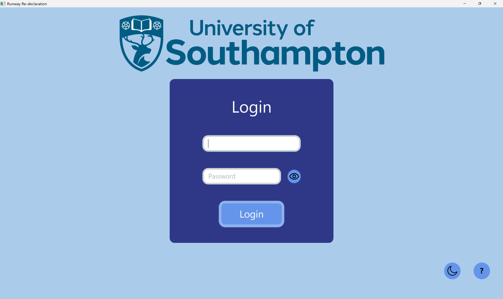
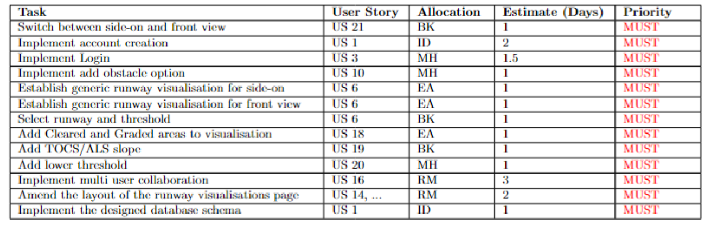
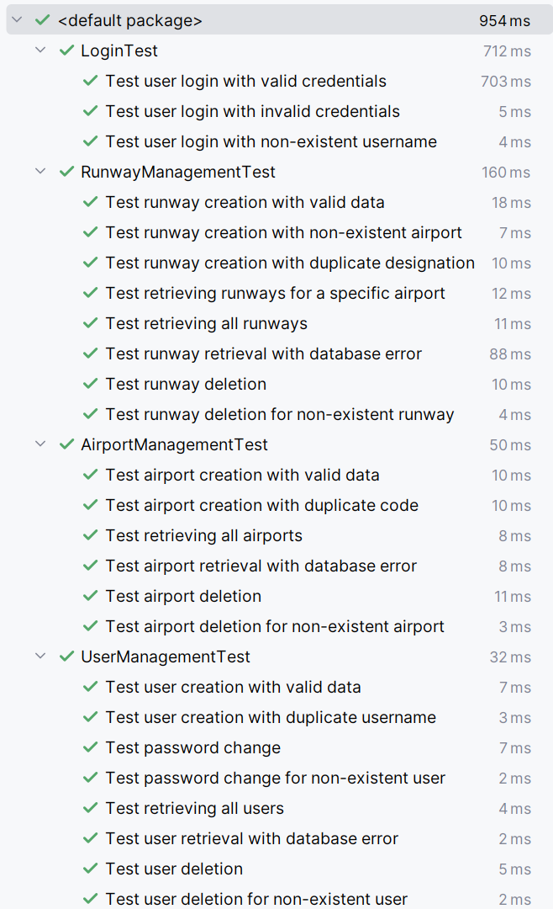
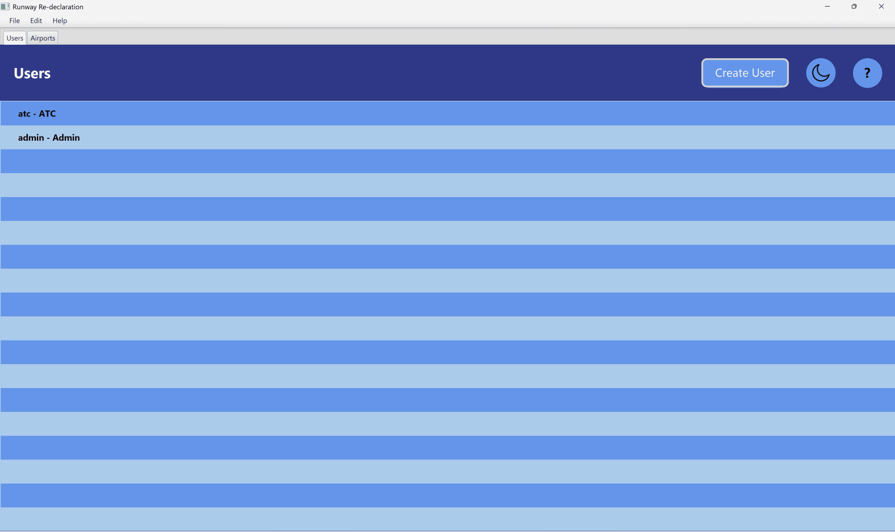
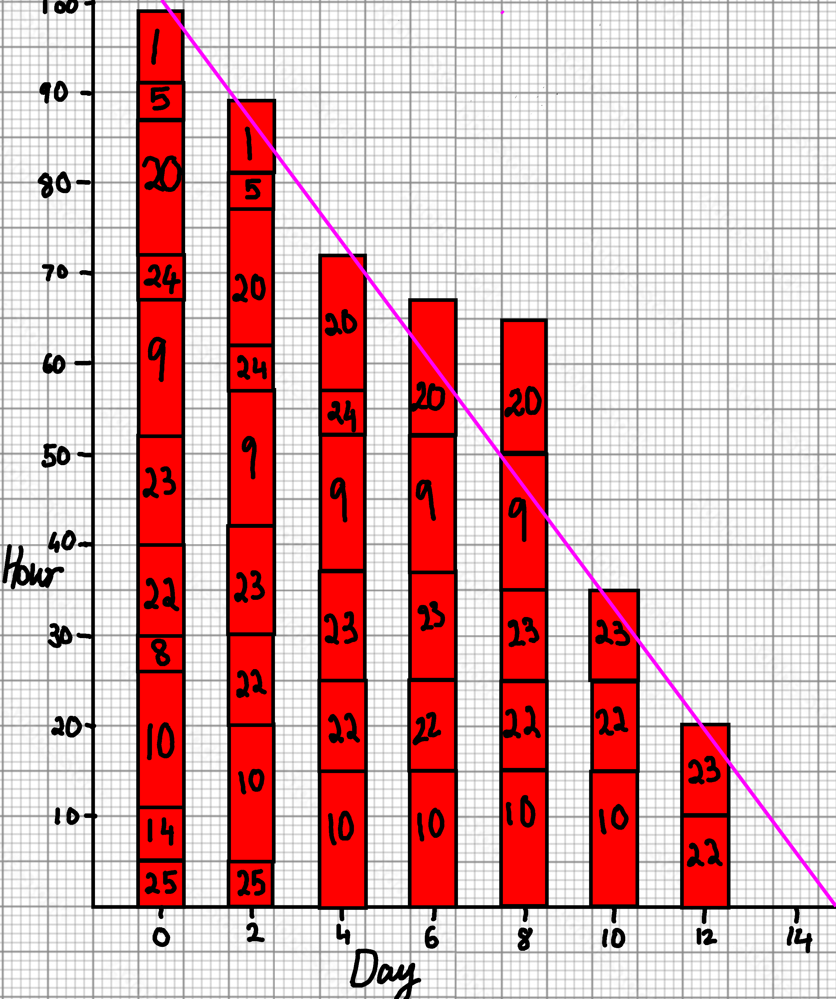
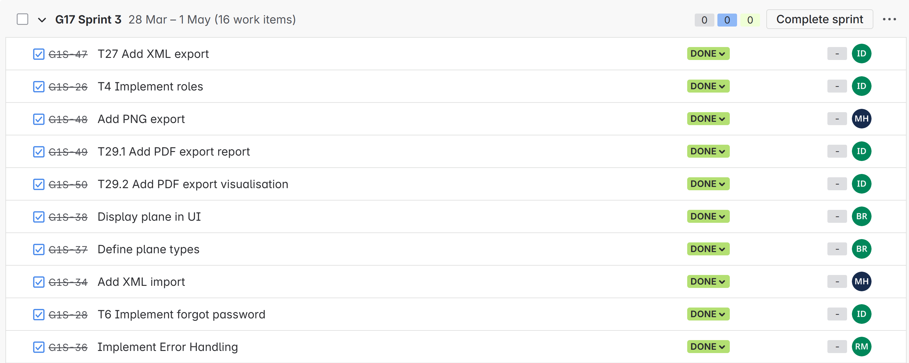
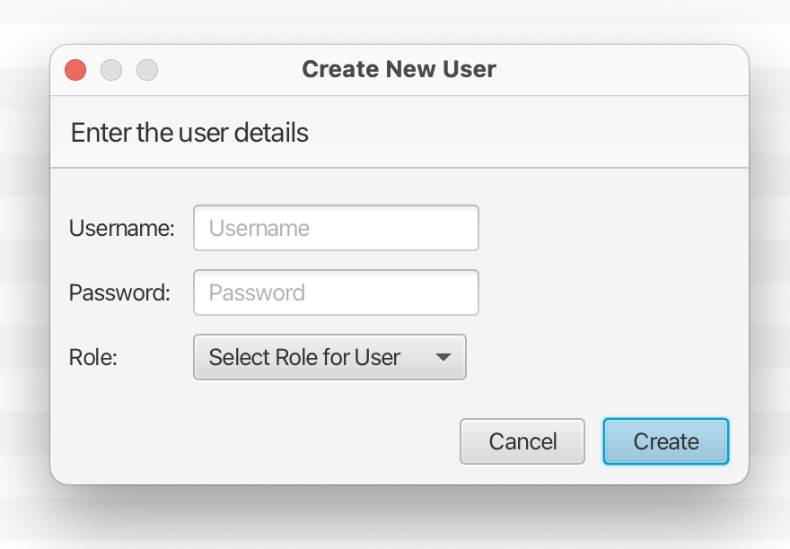
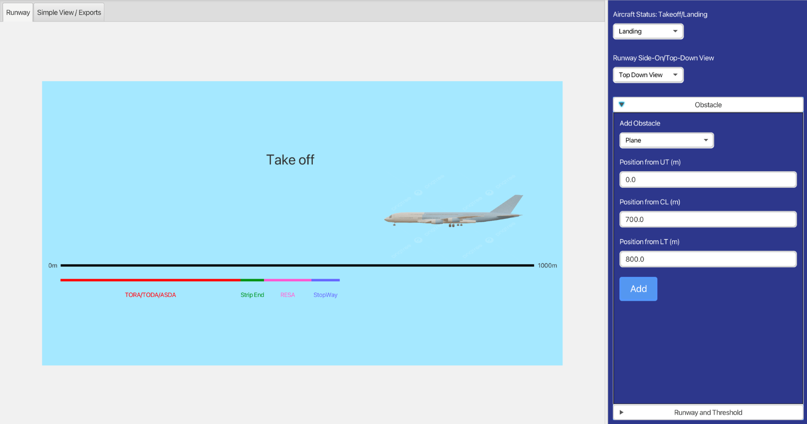

# Runway Safety & Re-declaration System

A **full-stack Java application** for airport runway safety management, built by a 5-person team using **Agile methodologies** for University Coursework. This system demonstrates advanced **Object-Oriented Programming** principles and implements the **MVC architecture** for clean separation of concerns.

---
## Table of Contents
- [Project Overview](#project-overview)
- [System Architecture](#system-architecture)
  - [Technical Stack](#technical-stack)
  - [Key Features](#key-features)
- [Agile Development Process](#agile-development-process)
  - [Team Structure & Methodology](#team-structure--methodology)
  - [Project Management](#project-management)
- [Testing & Quality Assurance](#testing--quality-assurance)
  - [Testing Strategy](#testing-strategy)
  - [Test Coverage](#test-coverage)
- [User Experience](#user-experience)
  - [Stakeholder-Focused Design](#stakeholder-focused-design)
  - [Key Interfaces](#key-interfaces)
- [Technical Highlights](#technical-highlights)
- [Role & Contribution](#role-&-contribution)
- [Deliverables List](#deliverables-list)
---

## Project Overview

This system addresses critical aviation safety challenges by providing:
- **Real-time runway obstruction analysis**
- **Multi-user collaboration** between different airport roles
- **Automated safety calculations** and visualisations
- **Stakeholder-focused UI/UX**

Built as part of a university software engineering course using **Scrum methodology** with 2-week sprints.

---

## System Architecture

### Technical Stack
- **Frontend**: JavaFX with custom UI components
- **Backend**: Java Socket Server (multi-threaded using ExecutorService for concurrency)
- **Database & ORM**: SQLite via ORMLite (ORM for mapping Java classes to DB tables)
- **Testing**: JUnit for unit testing, scenario testing, acceptance testing
- **Version Control**: Git with feature branching
- **Project Management**: Jira with sprint planning and product backlog

|  |  |
|:-----------------------:|:-----------------------:|
| Login Window               | Sprint Plan for Second Iteration     |

### Key Features
- **Role-based access control** (Admin, Air Traffic Control, Runway Staff)
- **Real-time collaboration** using socket programming
- **Dual visualization modes** (Side-on and Top-down views)
- **Automated safety calculations** for runway re-declarations
- **Comprehensive testing suite** with 20+ test cases

|  |  |
|:-----------------------:|:-----------------------:|
| Unit Tests Cases               | List of Users and Roles            |

---

## Agile Development Process

### Team Structure & Methodology
- **5-person team** with rotating leadership responsibilities
- **Scrum framework** with 2-week sprints
- **Daily stand-ups** and sprint retrospectives
- **Comprehensive documentation** including:
  - Stakeholder analysis and personas
  - User stories with MoSCoW prioritization
  - Risk analysis with mitigation strategies
  - UML diagrams and system architecture

### Project Management
- **Jira** for backlog management and sprint planning
- **Burndown charts** for progress tracking
- **Risk assessment** with contingency planning
- **Regular stakeholder feedback** integration

|  |  |
|:-----------------------:|:-----------------------:|
| Burndown Chart               | Product Backlog               |

---

## Testing & Quality Assurance

### Testing Strategy
- **Unit Testing**: 20+ test cases covering core functionality
- **Integration Testing**: Client-server communication validation
- **Scenario Testing**: End-to-end user workflow validation
- **Acceptance Testing**: User story fulfillment verification

### Test Coverage
- **Authentication & Authorization**
- **Runway Management & Calculations**
- **Real-time Collaboration**
- **UI/UX Functionality**
- **Database Operations**

---

## User Experience

### Stakeholder-Focused Design
- **Air Traffic Control**: Real-time visualization and decision support
- **Runway Staff**: Obstacle input and runway condition management
- **Administrators**: User management and system configuration
- **Pilots**: Indirect benefit through improved ATC decision-making

### Key Interfaces
- **Login System** with role-based access
- **Admin Dashboard** for user management
- **Runway Visualization** with multiple view modes
- **Real-time Collaboration** workspace

|  |  |
|:-----------------------:|:-----------------------:|
| Creating New User              | Side On Visualization               |

---

## Role & Contribution
### My Work and Challenges
- Primarily worked on the frontend (JavaFX), implementing MVC architecture and OOP design principles.
- Designed UI components, controls, and visualizations.
- Took on additional UI/UX design tasks from other memebers due to unseen circumstances, improving team workflow and time allocation.
- Collaborated with backend developers to integrate frontend and server functionality.

### Team Contributions
- Bharatraj KR: JavaFX visualization components for the side on view, UI controls, testing, UI/UX design.
- Ryan Mabson: Socket server, database architecture, real-time collaboration.
- Emily Armstrong: JavaFX visualizations for top down view, testing.
- Ilia Desiatchenko: Authentication system, user management, backend testing.
- Michaela Hegarty: Obstacle management, calculations, frontend integration.

## Deliverables List

Below are downloadable links to all major coursework deliverables:

- [Deliverable 1 (Stakeholder Analysis and Requirements)](./files/deliverable1.pdf)
- [Deliverable 2 (Design Architecture)](./files/deliverable2.pdf)
- [Deliverable 3 (Testing Report)](./files/deliverable3.pdf)
- [Deliverable 4 (Sprint Documentation)](./files/deliverable4.pdf)
- [Final Report](./files/final_report.pdf)

